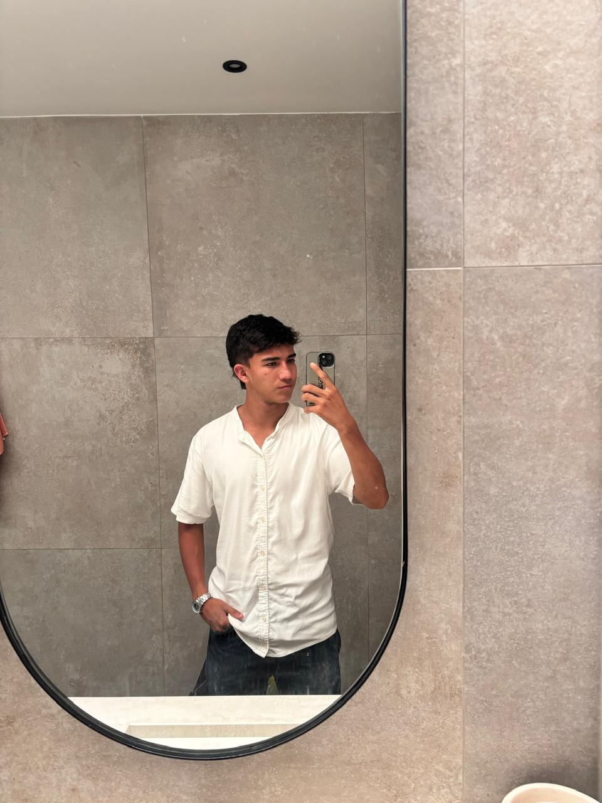

# 👨‍💻 Julian David Lizcano Manrique

Estudiante de Ingeniería en Sistemas, apasionado por el desarrollo de software y el aprendizaje constante de nuevas tecnologías. Me interesa construir soluciones eficientes, estructuradas y escalables que aporten valor real a los usuarios.

---

## 🚀 Sobre mí

Actualmente me encuentro fortaleciendo mis conocimientos en desarrollo web, con especial interés en tecnologías del lado del servidor. Me motiva comprender la arquitectura de las aplicaciones, la organización del código y las buenas prácticas en el desarrollo profesional.

Me caracterizo por la disciplina, la responsabilidad y el compromiso con cada proyecto que inicio.

---

## 🧩 Intereses Tecnológicos

- PHP
- Laravel
- Desarrollo Backend
- Arquitectura MVC
- Bases de datos relacionales
- Buenas prácticas de programación

---

## 📌 Proyecto en Desarrollo

Estoy iniciando un proyecto enfocado en **Laravel y PHP**, con el objetivo de:

- Aplicar el patrón Modelo-Vista-Controlador (MVC).
- Desarrollar una aplicación web estructurada y mantenible.
- Implementar autenticación, manejo de bases de datos y rutas.
- Seguir buenas prácticas de desarrollo y organización del código.

Este proyecto representa un paso importante en mi formación como desarrollador backend y en mi consolidación como ingeniero de software.

---

## 🎯 Objetivo

Mi meta es especializarme en el desarrollo web profesional, fortaleciendo mis bases en PHP y Laravel para crear aplicaciones sólidas, seguras y escalables.

---

> “El aprendizaje constante es la base de toda construcción sólida.”
